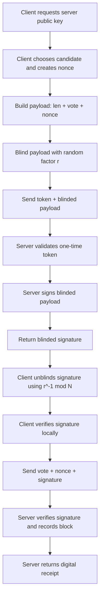
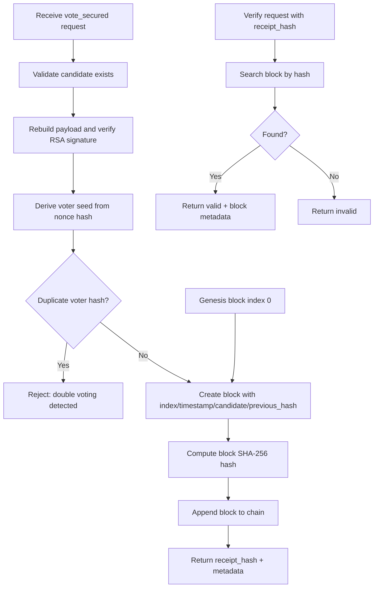
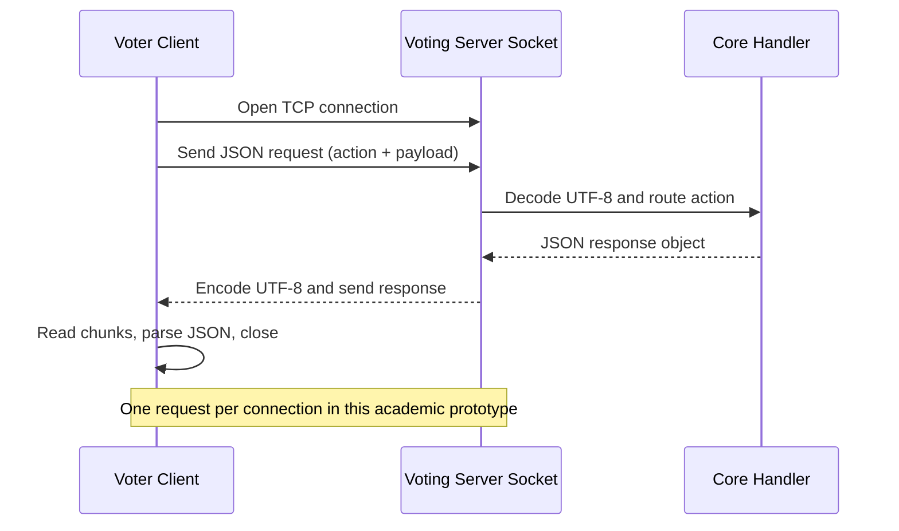
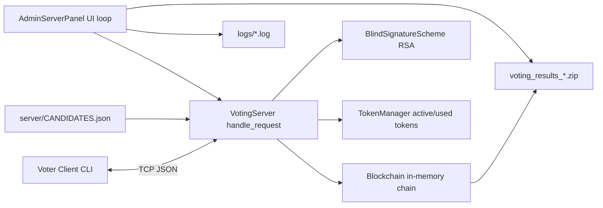

# TECHNICAL GUIDE - Blockchain Voting System (Variant A)

This document is for the development team. It explains architecture, core processes, implementation decisions, and how the repository fulfills the academic task in your own design.

> Scope note: this is an academic study implementation, intentionally optimized for clarity and defense/demo value rather than production-scale throughput or operational hardening.

## 1) System Overview

The system is a **single-node blockchain voting platform** with **anonymous vote authorization using RSA blind signatures**.

Core goals implemented:
- preserve voter privacy (server does not learn vote content during signing),
- enforce one-time voting,
- provide vote inclusion proof (receipt),
- provide chain integrity verification and auditable final outputs.

Main execution roles:
- **Admin role**: runs election, issues tokens, monitors status, stops election, exports final package.
- **Voter role**: connects via client, obtains blind signature with token, submits signed vote, stores receipt.
- **Server core**: validates protocol correctness, records vote block, serves verification and statistics endpoints.

## 2) Repository Components

### Server-side

- `server/server.py`
  - Central request router (`handle_request`)
  - Implements protocol actions:
    - `get_blind_signature`
    - `vote_secured`
    - `verify_receipt`
    - `results`, `validate`, `blockchain`, `statistics`, `public_key`
    - `request_test_tokens` (test support endpoint)

- `server/admin_server.py`
  - Interactive election operator panel
  - Starts socket server loop in background thread
  - Generates and optionally saves token files
  - Displays real-time statistics and results
  - On stop, archives final data into `voting_results_<timestamp>.zip`

- `server/blockchain.py`
  - In-memory append-only chain with genesis block
  - Maintains `voted_hashes` set for duplicate-vote prevention
  - Provides validation and aggregated statistics

- `server/crypto_utils.py`
  - `BlindSignatureScheme` using RSA math on integers
  - Generates keypair at startup
  - Signs blinded messages and verifies signatures

- `server/tokens.py`
  - One-time token lifecycle manager
  - Tracks active/used tokens and lightweight token event history

### Client-side

- `client/client.py`
  - Menu-driven CLI voter app
  - Blind-signature voting flow (connect -> choose candidate -> blind -> sign -> unblind -> verify -> submit)
  - Receipt verification and blockchain/result viewing
  - Local receipt export

- `client/crypto_client.py`
  - Client cryptographic primitives:
    - blinding/unblinding,
    - signature verification with server public key,
    - public key wrapper class.

### Test/support files

- `server/tests.py`
  - End-to-end and load-oriented workflow test suite
  - Includes setup, single-vote protocol check, concurrent voting, chain checks, result consistency.

- `server/CANDIDATES.json`
  - Candidate source of truth loaded at server initialization.

## 3) Network/API Contract (JSON over TCP)

Transport:
- Plain TCP sockets
- One JSON request per connection
- One JSON response per connection

Primary actions and intent:
- `candidates` - fetch candidate list
- `public_key` - fetch RSA public key (`N`, `e`)
- `get_blind_signature` - consume token + sign blinded payload
- `vote_secured` - validate signature and append vote block
- `verify_receipt` - verify by `receipt_hash` (preferred) or legacy `vote_hash + nonce`
- `results` - tally by candidate
- `blockchain` - return full chain
- `validate` - run integrity checks
- `statistics` - votes + token statistics
- `request_test_tokens` - generate tokens for automated tests

Design choice:
- JSON action routing keeps interface simple and language-agnostic for academic demonstration.

## 3.1) Architecture and Flow Diagrams (for defense)

### A) Blind-signature voting flow

### B) Blockchain vote-recording and verification flow

### C) Socket request-response flow

### D) Server structure overview

## 4) End-to-End Voting Protocol (Implemented)

### Phase A - Authorization for signing
1. Voter receives one-time token from admin.
2. Client asks server for public key.
3. Client creates payload:
   - `len(vote_bytes)` (2 bytes) + `vote_bytes` + `nonce(32 bytes)`.
4. Client blinds payload with random blinding factor.
5. Client sends `get_blind_signature` with token and blinded payload.
6. Server validates/consumes token and signs blinded message.

### Phase B - Vote submission
7. Client unblinds signature locally.
8. Client verifies signature locally before submission.
9. Client submits `vote_secured` with clear vote + nonce + unblinded signature.
10. Server reconstructs payload and verifies signature with same RSA public key.
11. If valid, server hashes nonce-derived identity and appends blockchain block.
12. Server returns receipt containing block hash and metadata.

Key privacy property:
- Server signs blinded payload, so it cannot link signing-time token validation to clear vote content cryptographically.

## 5) Blockchain Model and Data Design

Block fields:
- `index`
- `timestamp`
- `voter_id_hash`
- `candidate`
- `previous_hash`
- `hash`

Genesis block:
- index `0`, sentinel values (`GENESIS`), bootstrap hash.

Hashing and deduplication flow:
- In `vote_secured`, server computes `sha256(nonce)` as anonymous voter seed.
- `Blockchain.add_vote()` hashes that input again into stored `voter_id_hash`.
- Deduplication uses set membership (`voted_hashes`) to reject repeated voter hashes.

Validation checks in `validate_chain()`:
- duplicate voter hash detection,
- previous-hash link continuity,
- per-block hash recomputation consistency.

Design choice:
- This is a **single-node educational blockchain** (not distributed consensus). It emphasizes immutability and tamper evidence over decentralization.

## 6) Token Lifecycle and One-Time Vote Control

Generation:
- Admin panel (`option 1`) or test endpoint generates random 256-bit tokens.

Consumption:
- Token is consumed only at `get_blind_signature`.
- Reuse triggers explicit rejection (`Token already used`).

Why this design:
- A valid signed vote must originate from a consumed token.
- Token is not submitted in final vote payload, reducing direct linkability.

## 7) Receipt and Verifiability Model

On success, server returns receipt object with:
- `receipt_hash` (block hash),
- `vote_hash` (`sha256(vote_bytes + nonce)`),
- `nonce_hex`,
- block metadata (`index`, `timestamp`),
- mode marker.

Verification modes:
- Preferred: `receipt_hash` lookup in chain.
- Backward-compatible: find block by derived voter hash and compare expected `vote_hash`.

Team note:
- `receipt_hash` path should be treated as canonical in UI/docs for simpler and safer verification.

## 8) Concurrency and Runtime Behavior

Server:
- Admin wrapper accepts connections and spawns per-client threads.
- Blockchain writes are lock-protected (`threading.Lock`) in `add_vote`.

Implication:
- Concurrent vote submissions are supported while preserving append consistency and duplicate-vote checks.

## 9) Logging, Outputs, and Artifacts

Runtime logging:
- `logs/voting_server_<timestamp>.log` from admin server.

Client artifacts:
- `client/receipts/receipt_<timestamp>.json`
- `client/exports/blockchain_<timestamp>.json`

Final election package (admin stop):
- `results.json` (totals, ranking, winner metadata)
- `blockchain.json` (full chain snapshot + validity flag)
- `winner.txt` (human-readable summary)
- zipped as `voting_results_<timestamp>.zip`

## 10) Mapping to Variant A Requirements (Implemented Interpretation)

Based on your implementation and naming, your Variant A interpretation is:
- blockchain-backed vote ledger,
- voter anonymity via blind signatures,
- one-time eligibility mechanism (tokens),
- receipt-based voter verifiability,
- post-election audit package and integrity validation,
- stress/concurrency testing.

Important clarification:
- The prototype is not a decentralized peer-to-peer blockchain network.
- It is a centralized election authority with blockchain-like immutable log semantics.

## 10.1) Variant A Requirement Checklist

- `[Implemented]` Blockchain-based vote ledger with immutable hash-linked blocks in memory.
- `[Implemented]` Anonymous authorization using RSA blind signatures (server signs blinded payload).
- `[Implemented]` One-time voter eligibility via single-use random tokens.
- `[Implemented]` Vote inclusion proof via receipt (`receipt_hash`) and server-side verification.
- `[Implemented]` Blockchain integrity validation (hash links, block hash recomputation, duplicate checks).
- `[Implemented]` Election operator workflow (token generation, monitoring, final result package export).
- `[Implemented]` Client voter workflow (connect, vote, verify receipt, inspect blockchain/results).
- `[Implemented]` Stress/concurrency testing workflow in `server/tests.py`.
- `[Partially implemented]` End-to-end privacy posture: cryptographic anonymity is implemented, but transport is plain TCP without TLS.
- `[Partially implemented]` Auditability: verifiable receipts and exported artifacts exist, but no external notarization or independent verifier service.
- `[Out of scope]` Decentralized consensus / multi-node blockchain network.
- `[Out of scope]` Production IAM/SSO, hardened key management (HSM/KMS), and operational security controls.

## 11) Security and Trust Assumptions

Current assumptions:
- Admin/server host is trusted to run unmodified software.
- Transport is plain TCP (no TLS), suitable for lab/testing environment.
- Tokens are distributed securely outside system scope.

Threats mitigated:
- duplicate voting by same nonce-derived identity,
- token replay,
- chain tampering detection (post-write).

Threats not fully mitigated in current scope:
- network eavesdropping / MITM,
- malicious server operator behavior,
- full coercion-resistance / end-to-end cryptographic auditing.

## 12) Known Design Trade-offs

- **In-memory chain**
  - Fast and simple for coursework.
  - Volatile unless exported; no crash recovery journal.

- **No distributed consensus**
  - Easy to understand and demo.
  - Not equivalent to production public blockchain trust model.

- **Raw RSA blind-signature flow**
  - Clear educational implementation.
  - Requires careful payload size handling and secure transport in real deployments.

## 13) Demo Script for Presentation Day (human-run)

Suggested role split:
1. **Presenter A (Admin operator)**: runs `server/admin_server.py` and controls election lifecycle.
2. **Presenter B (Voter 1)**: runs first `client/client.py` session and performs a full vote.
3. **Presenter C (Voter 2 / Auditor)**: runs second client session, verifies receipt, checks blockchain and validation.

Live demo sequence:
1. Admin starts server and shows loaded candidates.
2. Admin generates tokens and distributes 2-3 sample tokens to voter presenters.
3. Voter 1 connects, votes through blind-signature flow, and saves receipt file.
4. Voter 2 repeats with a different candidate.
5. Auditor client opens "Verify Receipt" and proves one stored receipt exists on chain.
6. Auditor shows "See Blockchain" and "Validate Blockchain" outputs.
7. Admin opens current results view.
8. Admin stops voting and saves final zip package.

Evidence to show to evaluator:
- Token one-time behavior (attempt reuse and show rejection).
- Receipt-based verification success.
- Blockchain validity check success.
- Final packaged outputs: `results.json`, `blockchain.json`, `winner.txt`.
- Logs file in `logs/` showing request lifecycle.

## 14) How Team Members Should Operate the System

Suggested team workflow:
1. Start admin server.
2. Generate and distribute tokens.
3. Run one or more client sessions to cast votes.
4. Validate chain and monitor results during voting.
5. Stop election from admin panel and archive output package.
6. Optionally run `server/tests.py` for demonstrable test evidence.

## 15) Future Improvements (for report/discussion, not yet implemented)

- Add TLS sockets to protect transport confidentiality/integrity.
- Persist blockchain and token state to durable storage (with signed checkpoints).
- Add admin authentication/authorization boundary.
- Add cryptographic election parameters config (key rotation, election IDs).
- Add protocol transcript proofs for stronger end-to-end auditability.
- Separate APIs and domain models from CLI for easier integration testing.
